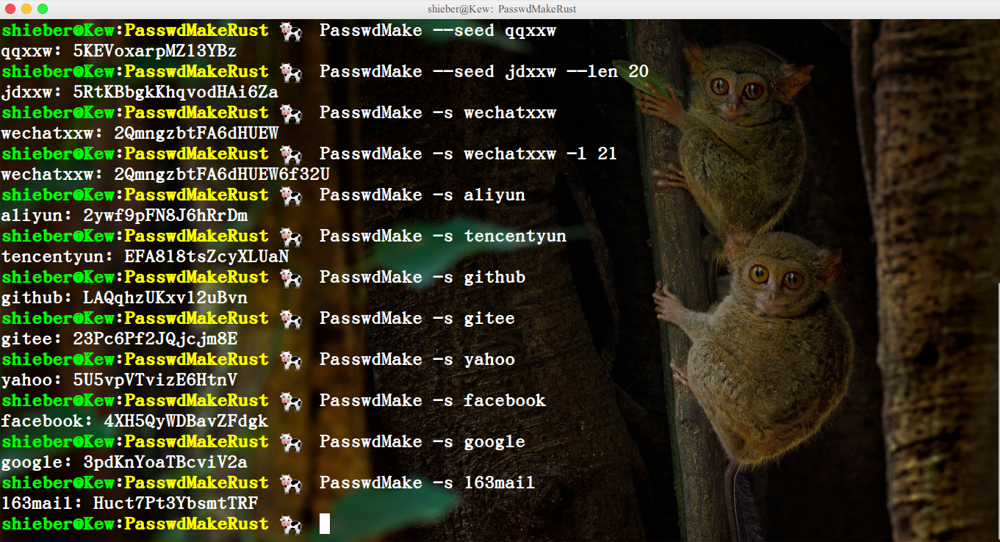

# PasswdMakeRust
:experimental:
:author: 'Shieber'
:date: '2021.02.17'

##### [link:README_CN.adoc[中文]] Make a password for any account via a seed.

### Usage [Add `release/main` to `/usr/local/bin`]

[source, shell]
.bash
-----
    $ # 1. copy executable file to a dir
    $ sudo cp release/PasswdMake /usr/local/bin/PasswdMake
    $
    $ # 2. [optional] if you like compile, do it and cp to a dir
    $ # cargo build --release 
    $ # sudo cp target/release/main /usr/local/bin/PasswdMake
    $
    $ # 3. use PasswdMake to generate password for any account
    $ PasswdMake --seed qqxxw # default len is 16
    $ PasswdMake --seed jdxxw --len 20
    $ PasswdMake -s wechatxxw # --seed equals -s, --len equals -l
    $ PasswdMake -s wechatxxw -l 21
-----

### Example

### Use pass to save the long-complex password as below

[source, shell]
.bash
-----
    $ sudo apt install pass # init set pass save dir...
-----

image::./savepasswd.gif[savepasswd]

