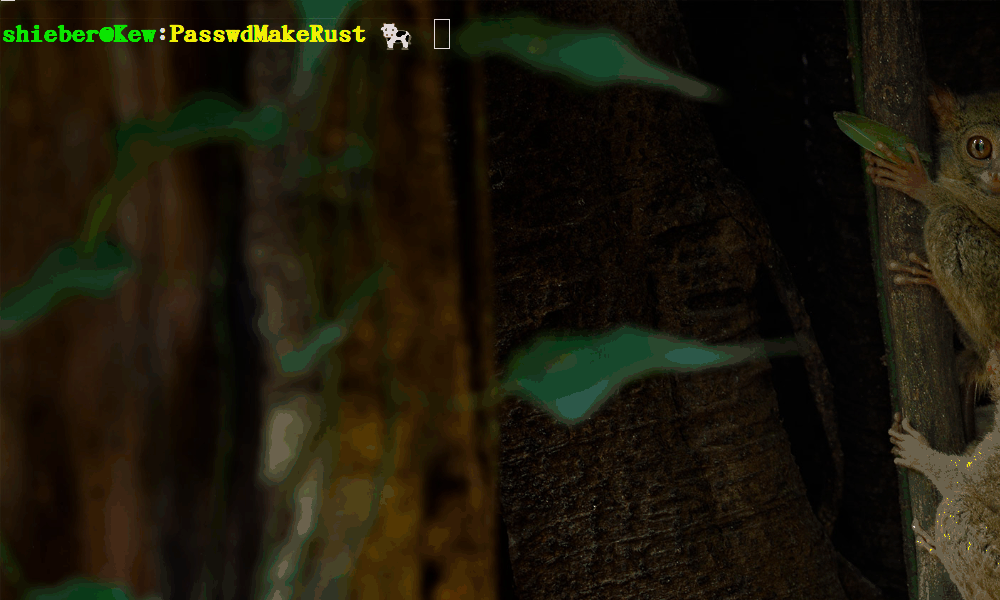

# PasswdMakeRust
:experimental:
:author: 'Shieber'
:date: '2021.02.17'

### [link:README_CN.adoc[中文]] Make a password for any account via a seed.

### Usage1

[source, shell]
.bash
----
    $ cargo run seed [length=16] # default password length is 16
    $ cargo run jdxjp 
    $ cargo run qqxjp 18 
    $ cargo run wechatxjp 
    $ cargo run wechatxjp 21
----

### Usage2 [Add target/release/main to /usr/local/bin]

[source, shell]
.bash
-----
    $ cargo build --release
    $ sudo cp target/release/main /usr/local/bin/PasswdMakeRust
    $ PasswdMakeRust jdxjp
    $ PasswdMakeRust qqxjp 18
    $ PasswdMakeRust wechatxjp 
    $ PasswdMakeRust wechatxjp 21
-----

### Example

image::./passwdmake.png[passwordmk.png]

image::./passwdmakeshell.png[passwordmsh.png]

### Use pass to save the long-complex password as below

[source, shell]
.bash
-----
    $ sudo apt install pass
-----

