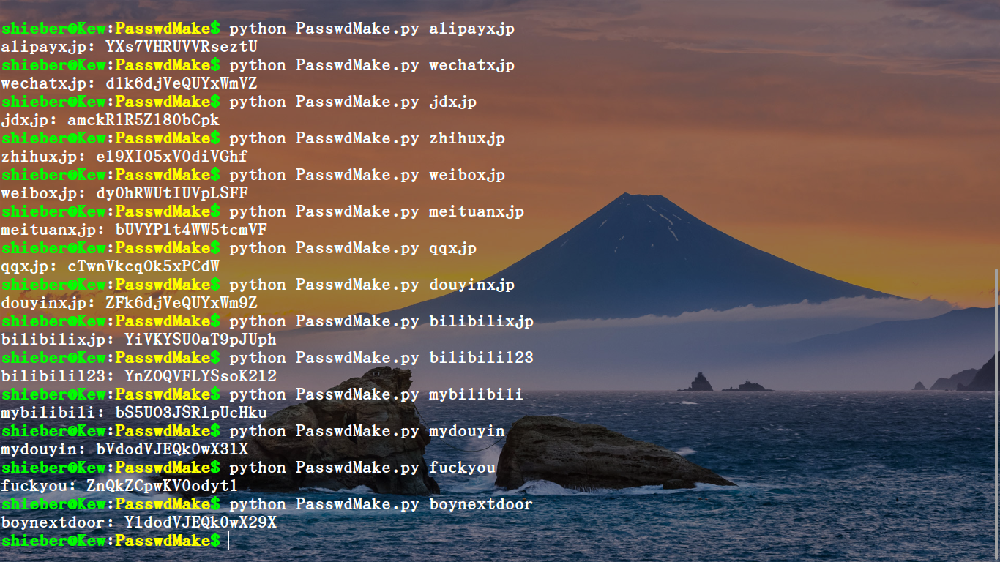

# PasswdMakeRust
:experimental:
:author: 'Shieber'
:date: '2021.02.17'

### [link:README.adoc[English]] 输入各种账号的 seed 以生成密码，seed 可以是账户种类加姓名或数字等。

此为 Rust 语言版，还有 Python 和 Go 版。Python 版文件放到系统内，但能被打开，不安全，go 和 rust 编译成的可执行文件放到系统就不用考虑安全问题。

### 用法1

[source, shell]
.bash
----
    $ cargo run seed [length=16] # default password length is 16
    $ cargo run jdxjp 
    $ cargo run qqxjp 18 
    $ cargo run wechatxjp 
    $ cargo run wechatxjp 21
----

### 用法2 [添加 target/release/main 到 /usr/local/bin]

[source, shell]
.bash
-----
    $ cargo build --release
    $ sudo cp target/release/main /usr/local/bin/PassswdMakeRust
    $ PasswdMake seed #命令行直接生成密码，省去用法1中冗长语法
-----

### 两种用法示例，左侧为输入的 seed，右侧为密码，可见，密码非常丰富，极难重复

image::./passwdmakeshell.png[passwordmakeshell.png]

这么长和复杂的密码如何保存？使用pass工具，安装如下。用pass保存PasswdMake生成的密码，以后要用时，再用pass输出密码，用pass -c account 还可保存密码到剪切板以直接粘贴到登录框。

[source, shell]
.bash
-----
    $ sudo apt install pass
-----

image::./savepasswd.gif[savepasswd]
