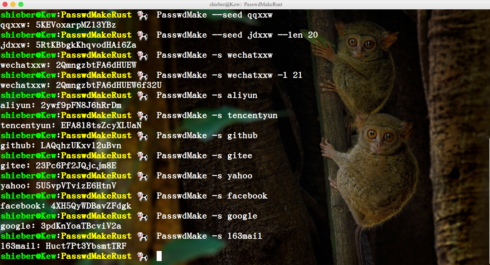
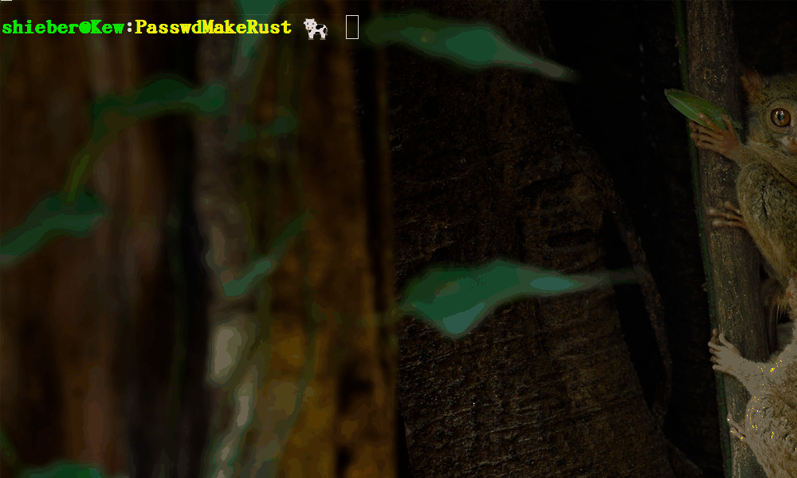

# PasswdMakeRust
:experimental:
:author: 'Shieber'
:date: '2021.02.17'

### [link:README.adoc[English]] 输入各种账号的 seed 以生成密码，seed 可以是账户种类加姓名或数字等。

此为 Rust 语言版，还有 Python 和 Go 版。Python 脚本能被打开，不安全，go 和 rust 可执行文件不用考虑安全问题。

### 用法 [添加 target/release/main 到 /usr/local/bin]

[source, shell]
.bash
-----
    $ cargo build --release
    $ sudo cp target/release/main /usr/local/bin/PasswdMake
    $ PasswdMake --seed qqxxw         # 密码默认长度 16
    $ PasswdMake --seed jdxxw --len 20
    $ PasswdMake -s wechatxxw         # --seed 短写 -s  --len 短写 -l
    $ PasswdMake -s wechatxxw -l 21
-----

### 用法示例

这么长和复杂的密码如何保存？使用 pass 工具，安装如下。

[source, shell]
.bash
-----
    $ sudo apt install pass
-----

用 pass 保存 PasswdMake 生成的密码，以后要用时，再用 pass 输出密码，用 pass -c account 还可保存密码到剪切板（只保存45秒）以直接粘贴到登录框。

